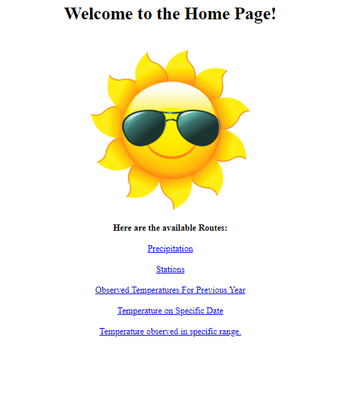

# Weather Station API

This project is focused around weather data collected from several different weather Stations thought Hawaii.  

## Frameworks Utilized:
* SQL Alchemy
* Python
* Flask
* HTML

Below are some of the routes that were created:

This was the homepage with different links that would query the flask server to return specfic results.

This was a sample jSON that would return the list through our SQL query.

This final screenshot shows how the database would connect specific SQL queries dynamically from the URL address entered.

Inlcuded is the jupyter notebook that was used for datamunging of all queries that were ultimately used in flask server development.